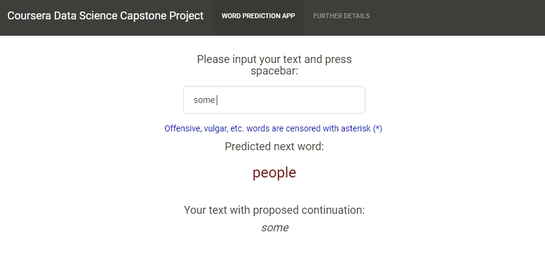

Word predicting application
========================================================
author: Maciej Komisarz
date: 09.04.2020
autosize: true
font-family: 'Calibri'
Coursera Data Science Capstone Project

1. A few words of introduction.
========================================================

Within Capstone Project, being the final part of Coursera Data Science Specialization from Johns Hopkins University (JHU), students have to create working data product. This product can be used as an example of their skills and can be shown to the potential employers.   
For the currently ongoing class, goal of the project is creation of an application for prediction of the next word when user types a sentence. It is a result of a partnership made by JHU with SwiftKey, in order to apply the data science techniques for Natural Language Processing.   
Dataset used for Capstone Project was downloaded from <b><a href="https://d396qusza40orc.cloudfront.net/dsscapstone/dataset/Coursera-SwiftKey.zip">this source</a></b>, and then unzipped. It contained files in 4 languages:
- German
- Finnish
- Russian
- US English  

Due to language reasons, only US English files were used.

2. What lies behind application...
========================================================

In the first step of application creation, aforementioned dataset was downloaded. Then it was initially cleaned from numbers, special signs, webpage addresses, etc. In the same time, all big letters were changed for small ones.   
Cleaned files were combined into one big database from which was taken subset equal to 5% of original file - due to very big RAM and disk usage. In the next step, subset was used for creation of n-grams of level 1, 2 and 3. Initially it was assumed that also n-grams of level 4 and 5 will be created, but these operations took an insane amount of time (not to mention again RAM and disk usage).   
The created n-grams were used in algorithm of word prediction. For each n-gram, the frequency of each word was calculated, columns were orderly named and ordered. Then, to improve accuracy, a Jelinek-Mercer smoothing was performed, combining trigram, bigram, and unigram probabilities. Predicted words were based on the unigrams.   
To avoid interpolation failures and provide some default predictions for parts of speech, part-of-speech tagging (POST) was used. Profanities and offensive words were filtered in the output values due to use of bad words list from Google.

3. ...application itself, and how to use it.
========================================================

The word predicting application was created using a Shiny package. When user enters the word, application treats it as an input, and suggest most likely next word, based on the created n-grams. Working web-based application can be found <b><a href="https://gkgm.shinyapps.io/PredictNextWord/"> here</a></b>. All source files for this project are stored in <b><a href="https://github.com/MKom1982/Coursera-Capstone-Project"> this</a></b> Github repository.

<b>Application works as follows:</b>

When user enters the text and presses the spacebar, the field with the predicted next word is immediately refreshed. In the same time, refreshed will be also the text output with complete text (i.e. text inserted by the user together with prediction).   
User interface of the application is shown on the next slide.

4. How does it look?
========================================================

